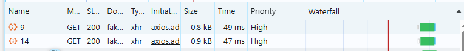

# DYNAMIC E-COMMERCE

##### Przykładowy pomysł na sklep z użyciem Next.js oraz TypeScript.

## Szybki start:

1. Kopiujemy pliki `.env.*.example` w to samo miejsce usuwając suffix `.example`.

#### Development server:

```bash
  npm run dev
```

[http://localhost:3000](http://localhost:3000)

#### Production-like server:

```bash
  npm run start
```

[http://localhost:3000](http://localhost:3000)


## Główne aspekty projektu:

- Projekt wykorzystuje funkcje zamiast klas — funkcje są przeważnie bezstanowe, a klasy zachęcają do używania stanu oraz generowania obiektów na podstawie modeli klasowych.
- Projekt wykorzystuje podejście deklaratywne zamiast imperatywnego — zdefiniowanie operacji przyspiesza development, nie pozwala na błędy oraz zapewnia powtarzalność.
- `/application/` — kod aplikacyjny bez wiedzy o biznesie.  
- `/domain/` — wiedza biznesowa bez narzutu aplikacyjnego.  
- `/UI/` — rzeczy związane z warstwą GUI.  
- `/app/` — katalog kompozycyjny wychodzący z frameworka `Next.js`.
- `*.atom.tsx`, `*.molecule.tsx`, `*.organism.tsx`, `*.composition.tsx` — suffixy buliding-blocków określające dane zastosowanie.
- `theme.ts` oraz `styles.policy.ts` — SSOT dla styli aplikacji.
- `models.config.ts` — SSOT dla modeli DTO.
- `http.endpoints.ts` — SSOT endpointów.
- `MuiIcons.adapter.tsx` — SSOT dla wszystkich ikon w aplikacji.
- Pliki `*.config.ts` są plikami konfiguracyjnymi, w założeniu czystymi, czytelnymi i bez zbędnego narzutu. Przykład: `store.config.ts`.
- Główny stan aplikacji: Pliki `*.read.ts` oraz `*.slice.ts` rozdzielają odczyt od zapisu.  
  Na przykładzie: `cart.read.ts` zawiera model danych oraz selektory (odczyt), natomiast `cart.slice.ts` — reduktory modyfikujące stan.  
- Pliki `*.api.ts` — jawnie umożliwiają korzystanie z wewnętrznego API (file-system API).


###### *SSOT - Single Source Of Truth


## Dodatkowe informacje oraz wyjaśnienia:

1. W obecnym przykładzie użycia fake api, które nie umożliwia faktycznej akcji dodawania nowych bytów do DB — można byłoby skonfigurować  
   build jako strony statyczne, który nie wymagałby procesu `node.js`, a dużo prostszy w utrzymaniu np. `apache`.
1. Prawdziwy sklep może być rozwiązany na różne sposoby: Czysty `Server Side Rendering (SSR)` lub hybryda, czyli budowanie istniejących stron do plików podczas build-time,  
   oraz dobudowywanie nowych stron podczas życia sklepu. Wymagane będzie zastosowanie mechanizmu `revalidate` oraz `Draft Mode`. 
1. Jakiekolwiek zależności projektowe zostały wybrane pod kątem stabilności oraz bycia production-ready.
1. W plikach `*.module.css` użyłem niestandardowego dla styli zapisu camelCase (zamiast kebab-case) z uwagi na używanie
   zmiennych w plikach JS.  
   Konwersja nastąpiłaby tak czy inaczej — jednak wolałem zrobić to w sposób jawny.
1. Stylowanie z użyciem CSS MUI odbywa się w większości w `theme.ts` oraz w środku building-blocków — dzięki temu 
   można wykorzystać JavaScript do manipulowania właściwościami CSS, szczególnie tych ze `STYLES_POLICY`. Komponenty i tak są re-używalne, więc nie występują żadne powtórzenia.
1. Produkty w koszyku zaciągane są ponownie, by potwierdzić ostateczne ceny przed zakupem. Pobierane są współbieżnie:
   


## Dziennik wybranych działań:

1. Zmodyfikowano `scripts` w `package.json` w celu prostej automatyzacji powtarzalnych działań (`dev` i `start`).
1. Warstwa wizualna komponentów została oparta o bibliotekę `Material UI`.
1. Zaimplementowano: HTTP layer do kontaktu z backendem. Do komunikacji HTTP posłużyła biblioteka `axios`.
1. Zaimplementowano: System do zgłaszania błędów w developmencie lub na produkcji do zewnętrznego trackera błędów.
1. Zaimplementowano: Zbiór modeli DTO.
1. Zaimplementowano: Adapter dla `Mui Icons`
1. Zaimplementowano: Adapter dla dat `dayjs`
1. Zaimplementowano: Pojawiająca się dodatkowa pływająca ikonka koszyka po dodaniu produktu do koszyka.  
   Znika po wyjściu z danej strony.
1. Zaimplementowano: Wyświetlanie cen bez spadającej waluty `Price.atom.tsx`.
1. Obsługa braku produktów w koszyku.
1. Ikonka usuwania produktu zamiast zmniejszania jego ilości w koszyku w przypadku ilości 1.
1. Zaimplementowano: Maksymalna długość dla description:  
   


## TODO / Co dalej?:


1. i18n — w celu zastąpienia zahardkodzonych tekstów kluczami i obsługa tłumaczeń.
1. Obsługa błędów HTTP — aplikacyjnych (np. połączenie internetowe/problem z serwerem) oraz domenowych zgodnie z
   założeniami biznesowymi (np. nie można dodać produktu do koszyka, bo cały stock został wykupiony 1 min temu przez
   kogoś innego)
1. Zdławienie szybkości CPU/Internetu i popracowanie nad loaderami, by upłynnić UX.
1. Przyciski `< Go Back` na stronach ułatwiające nawigację lub/i klikalne breadcrumbs.
1. Mechanizm `revalidate`, który będzie dobudowywał strony, dzięki czemu nowo dodane produkty przez CMS będą ładowały się tak samo szybko (po pierwszym wejściu).  
1. W plikach istnieje obsługa dat za pomocą adaptera `dayjs` — w dalszych pracach na pewno by się przydała.
1. W koszyku produkty po usunięciu nie muszą znikać — mogą się wyszarzać, by łatwej było przywrócić produkt oraz przejść na jego stronę.
1. Zgodnie z dalszymi potrzebami: ewentualna Dockeryzacja w celu łatwiejszej replikacji aplikacji pod zwiększone obciążenie/rynek ogólnoświatowy.
1. Pojawiająca się belka `FREE SHIPPING` po przekroczeniu jakiegoś progu ceny — dodając nowy produkt do koszyka, lub zwiększając ilość produktu w koszyku.
1. Cała masa innych rzeczy wynikających z budżetu/wymagań.
